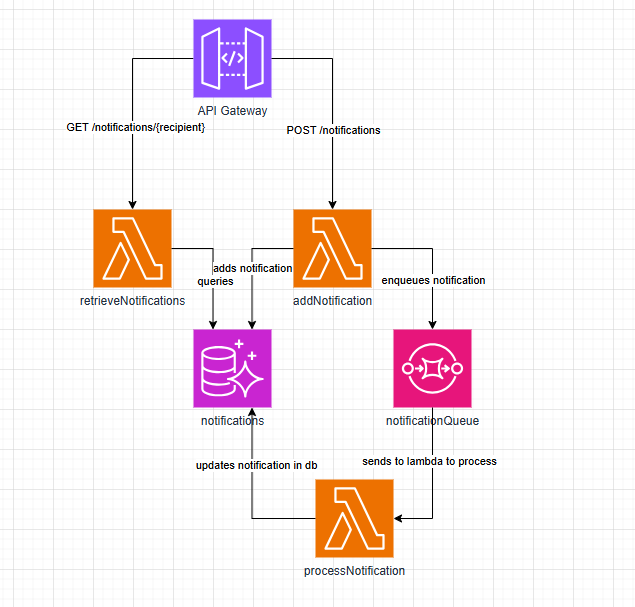

# Hogwarts Notifications Service

The system is structured as follows:

- An API gateway handling requests
- the `retrieveNotifications` lambda queries the database to get the needed notifications
- the `addNotification` lambda adds the notification to the database, and then queues the notification to be sent
- the `notificationQueue` holds all the queued notifications, sending them one by one to be processed
- the `processNotification` lambda handles the actual sending of the notification (for the purposes of this project, it just logs that the notification was sent) and then updates the notification in the database to reflect that it has been sent
- the `notifications` database. This is a simple table that holds all the notifications

# TODO: outline database table structure

## Other stuff

This is a blank project for CDK development with TypeScript.

The `cdk.json` file tells the CDK Toolkit how to execute your app.

## Useful commands

- `npm run build` compile typescript to js
- `npm run watch` watch for changes and compile
- `npm run test` perform the jest unit tests
- `npx cdk deploy` deploy this stack to your default AWS account/region
- `npx cdk diff` compare deployed stack with current state
- `npx cdk synth` emits the synthesized CloudFormation template
