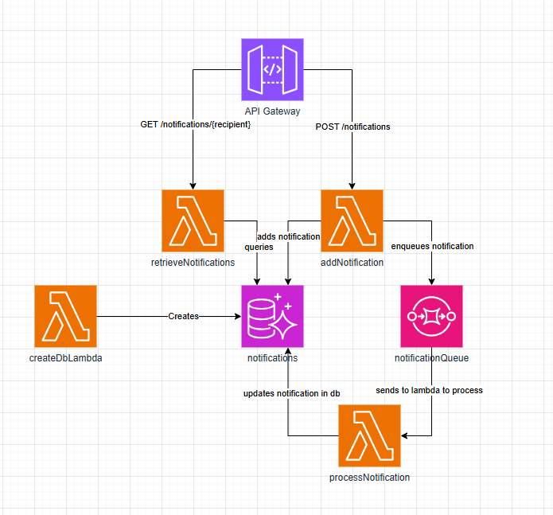

# Hogwarts Notifications Service

The system is structured as follows:

- An API gateway handling requests
- the `retrieveNotifications` lambda queries the database to get the needed notifications
- the `addNotification` lambda adds the notification to the database, and then queues the notification to be sent
- the `notificationQueue` holds all the queued notifications, sending them to be processed by the `processNotification` lambda
- the `processNotification` lambda handles the actual sending of the notification (for the purposes of this project, it just logs that the notification was sent) and then updates the notification in the database to reflect that it has been sent
- the `notifications` database. This is a simple table that holds all the notifications



Theoretically this could be extended to add a Dead Letter Queue to collect failures

## DB Structure

One table: Notifications

Columns:

- id
- recipient
- message
- status
- createdAt

## Setup instructions

This project was made with Node 22.18.0

1. In the root of the project, run

   ```
   npm i
   ```

2. Then in the `/src` directory, run

   ```
   npm i
   ```

   This ensures the dependencies necessary for the code inside the lambdas are included, as well as the dependencies needed to deploy the project to AWS.

This project uses the AWS CDK to automate deployment and creation of all resources.

See the [AWS CDK docs](https://docs.aws.amazon.com/cdk/v2/guide/getting-started.html) for more info on installing and configuring the CDK CLI itself.

3. Once you have the cdk cli configured, only two commands are needed to deploy the project to AWS. Build scripts have been configured to streamline the process:

   ```
   npm run build
   npm run deploy
   ```

   Once deployed, the API url will be displayed among the resource URLs in the console. It should look something similar to:

   ```
   HogwartsNotificationServiceStack.MyApiGatewayEndpoint84AE9DBF = https://93y3815dv7.execute-api.us-east-2.amazonaws.com/prod/
   ```

   You can use this URL to make requests to the API

When finished testing or developing, run the following command to tear down the resources:

```
cdk destroy
```

**WARNING**: This will also destroy the database, and any data in it will be lost.

## Example requests/responses

### POST /notifications

Example request:

```json
{
  "recipient": "Hermoine Granger",
  "message": "Reminder: Potions homework due tomorrow"
}
```

Example response:

```json
Successfully queued notification!
```

### GET /notifications/{recipient}

Optional querystring param: `limit`. Limits the number of returned items.

Example response:

```json
[
  {
    "id": "3b12f1df-5232-4804-897e-917bf397618a",
    "recipient": "Harry Potter",
    "message": "Did you put your name in the goblet of fire??!?!?",
    "status": "delivered",
    "createdAt": "2025-10-02T12:34:56Z"
  },
  {
    "id": "4a12f2ed-7890-1234-877f-263jb583729b",
    "recipient": "Harry Potter",
    "message": "Lunch has been delayed to 1:30pm",
    "status": "queued",
    "createdAt": "2025-11-02T12:34:56Z"
  }
]
```

## Other stuff

The `cdk.json` file tells the CDK Toolkit how to execute the app.

## Useful commands

- `npm run build` compile typescript to js
- `npm run watch` watch for changes and compile
- `npm run test` perform the jest unit tests
- `npx cdk deploy` deploy this stack to your default AWS account/region
- `npx cdk diff` compare deployed stack with current state
- `npx cdk synth` emits the synthesized CloudFormation template
